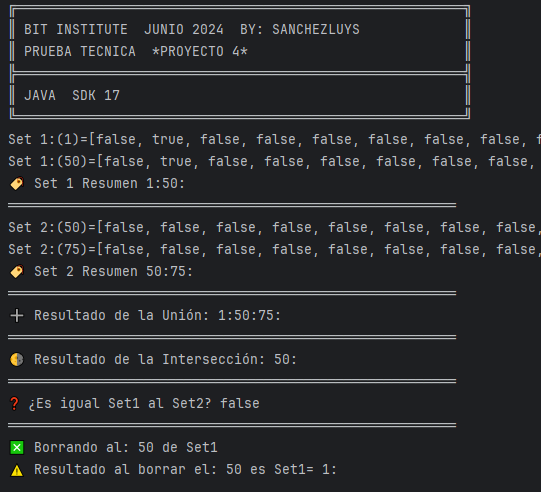

## Prueba Técnica

### Proyecto 4

### Solicitudes 
| Item | Clase                     | Estado |
|------|---------------------------|--------|
| 1    | IntegerSet                | ✅     |
|      | - Inserta                 | ✅     |
|      | - Borra                   | ✅     |
|      | - Verifica Union          | ✅     |
|      | - Verifica Interseccion   | ✅     |
|      | - Verifica si son iguales | ✅     |
|      |                           |        |
| 2    | Main                      | ✅     |

### Resultado:

